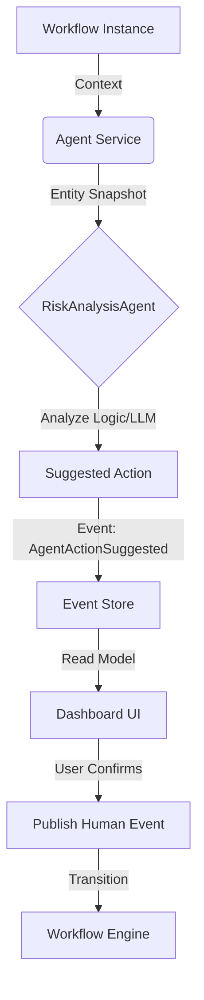

# AI Agent Integration Strategy in FlowOS

This document outlines the strategy for integrating AI Agents into FlowOS business workflows, enabling proactive suggestions while maintaining strict governance ("Law before Work").

## 1. Core Concept: Agents as Advisors

In FlowOS, agents act as intelligent advisors, not autonomous executors. They analyze the state of a workflow and produce **Suggested Actions** which must be confirmed by a human or a validated policy before execution.

### Key Components

* **AgentService**: The central orchestrator that manages agent execution.
* **IWorkflowAgent**: A specialized agent interface that understands workflow state.
* **SuggestedAction**: A structured proposal emitted by an agent (Event + Reason + Confidence).
* **Human-in-the-Loop**: The UI presents these suggestions to users for confirmation.

## 2. Architecture



## 3. Implementation Patterns

### 3.1 Defining an Agent

Implement `IWorkflowAgent` to create logic that reasons about specific business data.

```csharp
public class RiskAnalysisAgent : IWorkflowAgent
{
    public Task<AgentResult> ExecuteAsync(AgentContext context)
    {
        // 1. Read Data
        var expense = context.EntitySnapshot as Dictionary<string, object>;

        // 2. Reason
        if ((double)expense["Amount"] > 5000)
        {
            // 3. Suggest
            return AgentResult.WithActions("High Risk Detected", new List<SuggestedAction>
            {
                new SuggestedAction("EVT-ESCALATE", "Amount > $5k", 0.95)
            });
        }

        return AgentResult.FromInsight("No risk detected");
    }
}
```

### 3.2 Consuming Suggestions (UI)

The frontend subscribes to `AgentActionSuggested` events and displays them as "Smart Actions".

* **Insight**: "High value expense detected."
* **Action Button**: "Escalate to Director (95% Confidence)"

## 4. Business Use Cases

| Agent Type         | Trigger            | Logic                                                        | Suggestion                         |
|:------------------ |:------------------ |:------------------------------------------------------------ |:---------------------------------- |
| **Risk Analyzer**  | Expense Submission | Checks amount, history, and category against fraud patterns. | `EVT-ESCALATE` or `EVT-FLAG-FRAUD` |
| **Auto-Approver**  | Low Value Request  | Verifies budget availability and policy compliance.          | `EVT-APPROVE`                      |
| **Compliance Bot** | Contract Review    | Scans document for missing clauses.                          | `EVT-REQUEST-CHANGES`              |
| **Router**         | Support Ticket     | Classifies sentiment and topic.                              | `EVT-ROUTE-TIER2`                  |

## 5. Governance

* **Read-Only Context**: Agents receive a snapshot of data, preventing side effects during reasoning.
* **Explicit Intent**: Agents output structured events, not generic text.
* **State Machine Enforcement**: Even if an agent suggests an action, the `WorkflowEngine` validates it against the defined transitions. An agent cannot force an illegal move.
