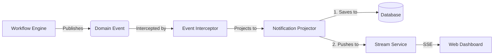

# FlowOS Notification System Documentation

## 1. Executive Summary

The **FlowOS Notification System** is a real-time, event-driven subsystem designed to alert users about relevant workflow activities (e.g., task assignments, approvals, system warnings). It operates on a **Decoupled Projection Model**, ensuring that user awareness is kept in sync with the core workflow state without coupling the two transactionally.

**Key Features:**
*   **Event-Driven**: Automatically generates notifications from Domain Events.
*   **Real-Time**: Pushes updates instantly to web clients via Server-Sent Events (SSE).
*   **Failure Isolated**: Notification errors cannot roll back business transactions.
*   **Multi-Tenant**: Strictly enforces tenant isolation for data streams.

---

## 2. Architecture

The system follows a linear pipeline: **Event** -> **Projection** -> **Persistence** -> **Broadcast**.

### 2.1 Component Diagram



### 2.2 Core Components

| Component | Role | Location |
| :--- | :--- | :--- |
| **Notification** | Domain Entity representing the alert. | `src/FlowOS.Notifications/Domain/Notification.cs` |
| **NotificationProjector** | Worker that maps Events to Notifications. | `src/FlowOS.Notifications/Application/NotificationProjector.cs` |
| **NotificationStreamService** | Manages SSE connections and broadcasting. | `src/FlowOS.Notifications/Application/NotificationStreamService.cs` |
| **NotificationsController** | API surface for history and streams. | `src/FlowOS.Notifications/Api/NotificationsController.cs` |

---

## 3. Data Model

The `Notification` entity is a read-only record designed for display.

| Property | Type | Description |
| :--- | :--- | :--- |
| `Id` | `Guid` | Unique identifier. |
| `TenantId` | `Guid` | Ensures multi-tenant isolation. |
| `CorrelationId` | `Guid?` | Links to the source `WorkflowInstanceId` or `TaskId`. |
| `EventType` | `string` | The technical event code (e.g., `EVT-TASK-ASSIGNED`). |
| `Message` | `string` | Human-readable alert text. |
| `Severity` | `string` | `Info`, `Warning`, or `Critical`. |
| `CreatedAt` | `DateTime` | UTC timestamp. |

---

## 4. Operational Workflow

### Step 1: Event Generation
The core engine executes a step and publishes a `DomainEvent`.
```csharp
// Core/Engine
var evt = new DomainEvent("EVT-TASK-ASSIGNED", ...);
_domainEventService.Publish(evt);
```

### Step 2: Projection
The `NotificationProjector` handles the event. It uses a `switch` expression to map technical events to user-friendly messages.

```csharp
// NotificationProjector.cs
private Notification? MapEvent(DomainEvent ev)
{
    return ev.EventType switch
    {
        "EVT-WORKFLOW-STUCK" => new Notification(..., "Workflow needs attention", "Critical", ...),
        "EVT-TASK-ASSIGNED" => new Notification(..., "Task assigned to you", "Info", ...),
        _ => new Notification(...) // Default fallback
    };
}
```

### Step 3: Persistence & Broadcast
If a mapping exists:
1.  The notification is saved to the `Notifications` table (for history/inbox).
2.  The `NotificationStreamService` serializes the notification to JSON and pushes it to all active `StreamClient` connections for that `TenantId`.

### Step 4: Consumption (Frontend)
The frontend establishes a persistent connection to `/api/notifications/stream`.
```javascript
// Client-side (Dashboard)
const eventSource = new EventSource('/api/notifications/stream');
eventSource.onmessage = (event) => {
    const notification = JSON.parse(event.data);
    toast.show(notification.Message);
};
```

---

## 5. API Reference

### Get Notification History
Fetch past notifications for the current tenant.

*   **Endpoint**: `GET /api/notifications`
*   **Auth**: Required
*   **Response**: `200 OK`
    ```json
    [
      {
        "id": "...",
        "message": "Task assigned to you",
        "severity": "Info",
        "createdAt": "2023-10-27T10:00:00Z"
      }
    ]
    ```

### Subscribe to Stream
Open a Server-Sent Events (SSE) channel.

*   **Endpoint**: `GET /api/notifications/stream`
*   **Auth**: Required
*   **Headers**:
    *   `Accept: text/event-stream`
    *   `Cache-Control: no-cache`
*   **Payload (Streamed)**:
    ```
    data: {"Message":"Workflow Started","Severity":"Info",...}
    
    data: {"Message":"Task Overdue","Severity":"Warning",...}
    ```

---

## 6. Reliability & Guarantees

### Failure Isolation
The Notification system is designed as a **Side Effect**.
*   **Transaction Safety**: Notifications are generated *after* the core business transaction commits.
*   **Safe Failure**: If the Notification Service crashes (e.g., DB error, Stream error), the **Workflow State remains valid**. The user might miss an alert, but the business process is not interrupted.

### Idempotency
*   **At-Least-Once Delivery**: In rare network retry scenarios, an event might be processed twice.
*   **Outcome**: This may result in duplicate notifications. This is an intentional design choice to favor robustness over strict exactly-once delivery complexity.

---

## 7. Extension Guide

To add a new notification type (e.g., for a new custom event):

1.  **Define the Event**: Ensure your workflow publishes the new event code (e.g., `EVT-FRAUD-DETECTED`).
2.  **Update Mapper**: Edit `NotificationProjector.cs` to handle the new code.
    ```csharp
    "EVT-FRAUD-DETECTED" => new Notification(..., "Fraud check failed!", "Critical", ...),
    ```
3.  **Deploy**: The system will automatically start projecting the new event.
